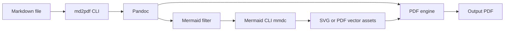
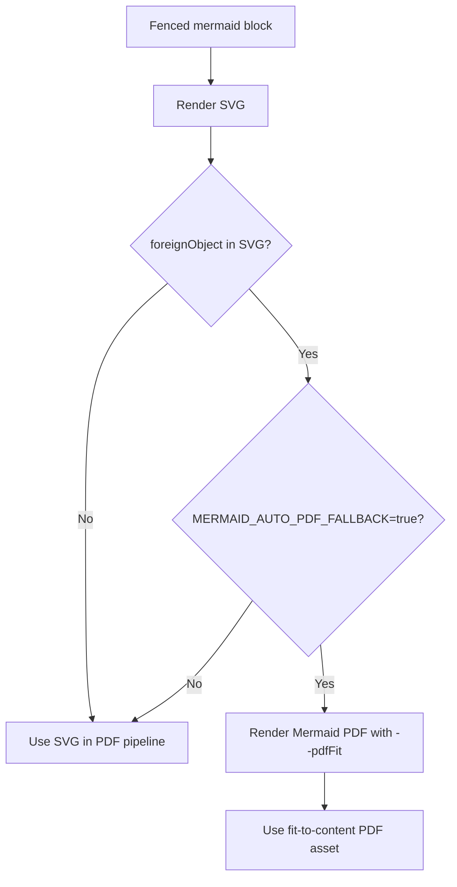

# md2pdf Architecture

## Purpose

`md2pdf` converts Markdown to PDF with a specific focus on Mermaid diagrams rendered as vector assets so diagrams stay sharp at any zoom level in the final PDF.

## Conversion pipeline

## Mermaid rendering strategy

## Components

- `bin/md2pdf`
  - Main CLI entrypoint.
  - Loads config from global/project/optional explicit config file.
  - Invokes pandoc with the Mermaid filter and PDF engine.
  - Optionally cleans temporary Mermaid assets after conversion.
- `lib/pandoc_mermaid_filter.py`
  - Detects fenced Mermaid blocks during pandoc filtering.
  - Calls `mmdc` to render each diagram.
  - Uses `MERMAID_LATEX_FORMAT=svg` by default for high-resolution vector output.
  - Rewrites Mermaid blocks to image references so pandoc includes Mermaid-rendered assets.
- `lib/run_pandoc_mermaid_filter.sh`
  - Wrapper that runs the Python filter with configured Python executable.
- `assets/table-style.tex`
  - Optional LaTeX header for table formatting.
- `assets/mermaid.config.json`
  - Default Mermaid config for PDF-safe text rendering (`flowchart.htmlLabels=false`).
  - Ensures edge labels use opaque backgrounds so arrow lines do not strike through label text.

## Configuration model

Load order (later overrides earlier):

1. `$HOME/.config/md2pdf/config.env`
2. `<input-markdown-directory>/.md2pdfrc`
3. `--config <file>`
4. Environment variables
5. CLI cleanup flags (`--keep-mermaid-assets`, `--cleanup-mermaid-assets`)

Defaults:

- `PDF_ENGINE=xelatex`
- `LR_MARGIN=0.7in`
- `TB_MARGIN=0.5in`
- `MERMAID_CONFIG=assets/mermaid.config.json`
- `MERMAID_LATEX_FORMAT=svg`
- `MERMAID_PDF_FIT=true`
- `CLEANUP_MERMAID_ASSETS=true`
- `MERMAID_ASSET_PREFIX=md2pdf-mermaid`

## Temporary Mermaid assets

For each conversion run with Mermaid content, md2pdf creates:

- `<MERMAID_ASSET_PREFIX>-<run-id>-images/`

This directory contains `.mmd` and Mermaid output files (`.svg` by default).
By default it is removed after conversion (`CLEANUP_MERMAID_ASSETS=true`).

## Finder Quick Action (macOS)

- `scripts/install_md2pdf_quick_action.sh` creates a Finder Quick Action.
- `scripts/uninstall_md2pdf_quick_action.sh` removes it.
- These scripts are macOS-only and independent of Linux CLI support.

## Validation and samples

- Smoke test: `tests/architecture-smoke-test.md`
- Full Mermaid sample suite: `tests/samples/mermaid-all-diagram-types.md`
