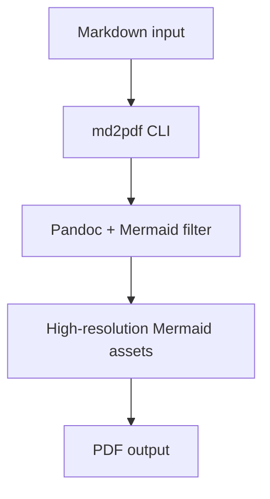

# md2pdf Architecture Smoke Test

This markdown file verifies that Mermaid diagrams are rendered as vector assets and embedded in the output PDF.

## Data pipeline



## How to run

```bash
md2pdf ./tests/architecture-smoke-test.md
```

Optional: keep generated Mermaid assets for inspection.

```bash
md2pdf ./tests/architecture-smoke-test.md --keep-mermaid-assets
```

